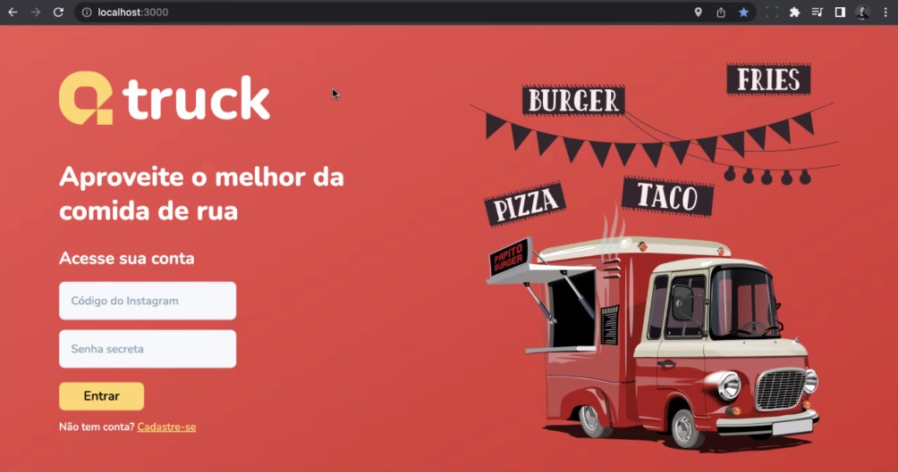
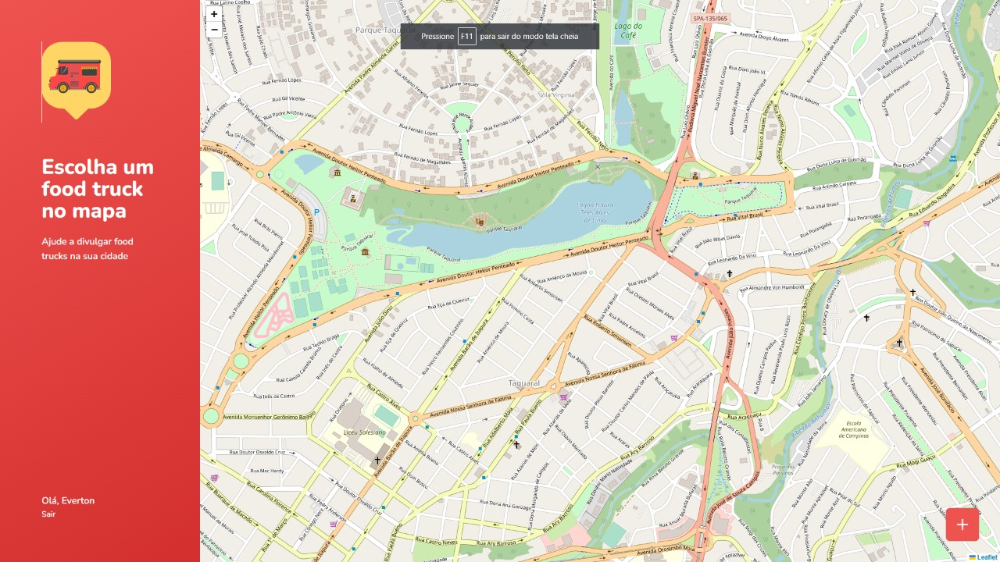

## Aplicação para estudos automação de QAcademy<br>

<br>
⚡ LOGIN <br>
<br><br>

⚡ DASHBOARD <br>
<br><br>


### Componentes necessários para executar o projeto
- Nodejs (Versão *16.16*)
- yarn

### Informações para execução do Projeto

*Clonar o projeto da aplicação*
```
$ git clone https://github.com/evrasouza/qtruck-application
```

### Informações baixar as dependencias da Aplicação e executa-lo

*_1º Passo - Baixar as dependencias da Aplicação Qtruck_* <br/>
  1.1. Em um terminal baixar as dependencias de backend <br/>
     Na pasta de backend no terminal, informe o comando <br/>
     ```
    $ yarn install -D
    ```    <br/>
  1.2. Em um terminal baixar as dependencias de Frontend <br/>
     Na pasta de Frontend no terminal, informe o comando <br/>
     ```
    $ yarn install -D
    ```    <br/>
    
*_2º Passo - Start as Aplicações Qtruck_* <br/>
  2.1. No mesmo terminal que baixou as dependencias deo Backend <br/>
     Na pasta de Tests no Backend, informe o comando <br/>
     ```
    $ yarn dev
    ```  <br/>
  2.2. No mesmo terminal que baixou as dependencias deo Frontend <br/>
     Na pasta de Tests no FrontEnd, informe o comando <br/>
     ```
    $ yarn dev
    ```  <br/>
